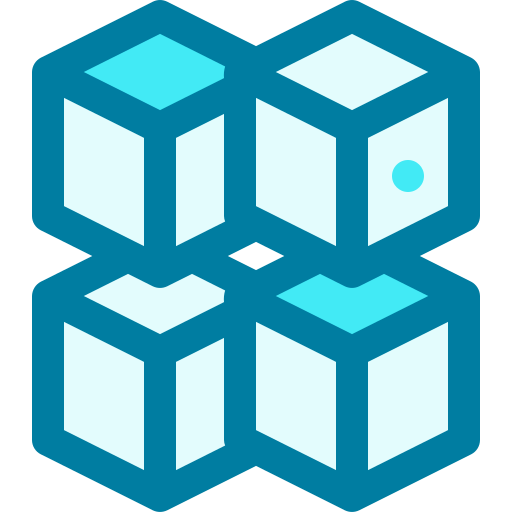

<h2>Jobsheet 1 - Pengenalan Struktur Data &nbsp;&nbsp;</h2>

	
----

<code style="color : aquamarine;">Struktur data</code> adalah sebuah cara mengatur, menyimpan, dan menyusun data di dalam media penyimpanan sebuah komputer sehingga data tersebut dapat digunakan secara efisien.  

   di atas merupakan contoh-contoh struktur data yang paling umum digunakan dan diketahui
  

----

<h2>Jobsheet 2 - Array, Pointer dan Struct &nbsp;&nbsp;</h2>

----

<code style="color : aquamarine;">Array</code> merupakan kumpulan nilai dengan tipe data yang sama, yang dimana masing masing elemen di dalam array ini diberikan indeks, elemen yang terdapat pada array dapat diakses menggunakan indeks dari elemen yang terkait.  

<code style="color : aquamarine;">Pointer</code> merupakan variabel yang berisi alamat memory dari variable yang memiliki nilai tertentu. Deklarasi variable pointer mirip dengan variabel biasa hanya saja ditambahkan tanda "*" yang disebut <b>asterisk</b> di depan nama variabel tersebut, tanda asterisk ini juga dapat digunakan untuk mengakses nilai dari variabel yang telah ditunjuk oleh variabel pointer.  

<code style="color : aquamarine;">Struct</code> adalah kumpulan variabel bertipe data berbeda-beda yang terletak di dalam satu nama objek, programmer perlu menentukan terlebih dahulu tipe data dari variabel yang ada di dalam struct sebelum mendeklarasikan struct, setelah itu struct dapat dideklarasikan menggunakan keyword "struct" atau "typedef struct". 

 

----

<h2>Jobsheet 3 - Single Linked List &nbsp;&nbsp;</h2>

----
 
<code style="color : aquamarine;">Array</code> memiliki kelemahan yang berupa sifatnya yang statis yang memiliki arti bahwa data yang kita simpan pada memori harus dalam kondisi urut, terlebih lagi, ukuran dari array tidak dapat berubah selama program berjalan. Dalam pemrograman, ukuran dari sebuah objek belum dapat ditentukan selama program belum berjalan, oleh karena itu alokasi memori secara dinamis dibutuhkan agar user dapat membuat tipe data dengan ukuran berapapun sesuai kebutuhan program.   
<code style="color : aquamarine;">Linked list</code> merupakan salah satu struktur data yang memorinya dialokasikan secara dinamis, Linked list sendiri adalah sebuah data yang berupa simpul beralamat yang saling bertaut, setiap simpul bisa menyimpan data dalam tipe char, int, string dan tipe lainnya.   
Untuk memulai membuat linked list, kita harus membuat sebuah simpul khusus yang berisi alamat atau pointer, simpul ini disebut <b>HEAD</b>, kemudian pada akhir simpul diberi alamat kosong yang tidak menuju kemanapun atau <b>NULL</b> yang disebut dengan simpul <b>TAIL</b>
  

----

<h2>Jobsheet 4 - Doubly Linked List &nbsp;&nbsp;</h2>

----
 
<code style="color : aquamarine;">Double Linked List</code> merupakan linked list dengan dua pointer, jika linked list biasa/single linked list umumnya memiliki satu pointer untuk ke linked list selanjutnya, maka, double linked list memiliki dua pointer yang mana satu pointer lainnya ditujukan ke linked list sebelumnya. Hal ini memungkinkan kita mengeksplor atau menjelajah double linked list melalui dua arah tersebut, lain halnya dengan single linked list dimana kita hanya bisa menjelajahinya melalui satu arah saja.   
Untuk membuat double linked list, caranya hampir sama dengan single linked list, hanya saja pada double linked list ditambahkan satu pointer tambahan untuk menuju linked list sebelumnya.   
<code style="color : aquamarine;">Double Linked List</code> memiliki beberapa kelebihan lainnya jika dibandingkan dengan single linked list, yaitu :  
<b>1.Operasi penghapusan lebih efisien menggunakan pointer yang menunjuk ke simpul yang akan dihapus.</b>  
<b>2.Dapat melakukan proses insert() yang lebih efisien dibandingkan single linked list.</b>
  

----

<h2>Jobsheet 5 - Circular Linked List &nbsp;&nbsp;</h2>

----
 
<code style="color : aquamarine;">Circular Linked List</code> dapat berupa single linked list atau double linked list tetapi circular linked list ini tidak mempunyai TAIL, sehingga pointer selanjutnya dari elemen terakhir mengarah kembali ke HEAD, jika circular linked list digunakan dalam bentuk double linked list, pointer sebelumnya dari HEAD akan menunjuk ke elemen terakhir. Hal inilah yang menyebabkan namanya menjadi Circular Linked List.
  

----

<h2>Jobsheet 6 - Stack &nbsp;&nbsp;</h2>

----
 
<code style="color : aquamarine;">Stack</code> merupakan kumpulan data, dimana data tersebut diletakkan di atas data yang lainnya. Oleh karena itu, stack menggunakan konsep <b>LIFO (Last In First Out)</b>, LIFO merupakan sebuah konsep pengaturan data dimana data yang paling terakhir masuk ke dalam stack adalah data yang pertama kali dikeluarkan dari stack.   
Stack dapat dibuat dalam bentuk ouble Linked List ataupun Linked List, meskipun penggunaan stack dalam bentuk array dianggap kurang tepat karena array memiliki sifat statis sedangkan elemen stack sangat bervariasi dan dinamis, tetapi hal itu masih memungkinkan. Stack dengan array dapat dibuat dalam dua bentuk yaitu <code style="color : aquamarine;">Single Stack</code> dan <code style="color : aquamarine;">Double Stack</code>
  

----

<h2>Jobsheet 7 - Queue &nbsp;&nbsp;</h2>

----
 
<code style="color : aquamarine;">Queue</code> adalah kumpulan data yang mana data di dalamnya berbaris layaknya sebuah antrian, karena itulah Queue ini menggunkan konsep yang disebut dengan <b>FIFO (First In First Out)</b>, FIFO merupakan sebuah konsep pengaturan data dimana data yang paling awal masuk adalah yang paling awal keluar dari Queue.   
<code style="color : aquamarine;">Queue</code> memiliki dua pointer yang menunjuk ke elemen pertama <b>FRONT</b> dan elemen terakhir <b>REAR</b> dari Queue, ketika menginisialisasi Queue, nilai FRONT dan REAR ditetapkan menjadi -1, lalu sebelum sebuah data masuk ke dalam Queue, maka nilai dari kedua variabel tersebut ditambah menjadi 0, sehingga sebuah data awal tersebut ditempatkan di indeks 0. Jika ada tambahan data yang masuk ke Queue, yang bertambah selanjutnya adalah hanya REAR saja, sedangkan FRONT akan tetap berada di data pertama.
  

----

<h2>Jobsheet 8 - Bubble dan Insertion Sort &nbsp;&nbsp;</h2>

----
 
<code style="color : aquamarine;">Bubble Sort</code> adalah salah satu algoritma pengurutan sederhana yang bekerja dengan cara membandingkan dan menukar elemen-elemen yang berdekatan satu sama lain jika tidak berada dalam urutan yang benar. Bubble Sort membandingkan dua elemen yang berdekatan dan menukarnya jika urutannya salah. Proses ini diulang untuk setiap pasangan elemen dalam array hingga tidak ada lagi pertukaran yang dilakukan, menandakan bahwa array sudah terurut.    
<code style="color : aquamarine;">Insertion Sort</code> adalah algoritma pengurutan yang bekerja dengan cara membandingkan setiap elemen dalam array dengan elemen-elemen sebelumnya, lalu memasukkan elemen tersebut ke posisi yang tepat dalam array yang sudah terurut. Insertion Sort bekerja seperti saat kita menyusun kartu di tangan, di mana kita membandingkan kartu yang akan dimasukkan dengan kartu-kartu yang sudah diurutkan sebelumnya.   
Bubble Sort memiliki kompleksitas waktu O(n^2) dalam kasus terburuk dan rata-rata, di mana n adalah jumlah elemen dalam array. sedangkan Insertion Sort memiliki kompleksitas waktu O(n^2) dalam kasus terburuk dan rata-rata, namun lebih efisien daripada Bubble Sort dalam beberapa kasus.
  

----

<h2>Jobsheet 9 - Selection dan Merge Sort &nbsp;&nbsp;</h2>

----
 
<code style="color : aquamarine;">Selection Sort</code> adalah sebuah algoritma pengurutan data yang mengurutkan data dengan cara mencari elemen terkecil pada sebuah list data yang belum terurut, lalu meletakkan elemen terkecil tersebut di paling depan dari sebuah list data.   
Cara kerja Selection Sort : elemen pertama dari urutan ditetapkan menjadi element terkecil dan dimasukkan ke dalam variabel <b>"minimum"</b>, lalu variabel minimum dibandingkan dengan elemen kedua, jika elemen kedua lebih kecil dari "minimum" maka elemen kedua yang akan menjadi minimum, begitu seterusnya hingga akhir dari urutan, setelah setiap perulangan, "minimum" diletakkan di paling depan urutan list data.
   

----

<h2>Jobsheet 10 - Shell dan Quick Sort &nbsp;&nbsp;</h2>

----
 
<code style="color : aquamarine;">Shell Sort</code> adalah sebuah algoritma pengurutan data dengan pengurutan elemen pertama memiliki jarak interval dengan elemen yang akan dibandingkan, jarak interval diantara elemen akan semakin mengecil seiring semakin banyaknya pengulangan pengurutan yang dilakukan, Shell sort memiliki beberapa formula pengurutan, yaitu :     <b>1.Shell's original sequence : N/2, N/4, ..., 1</b>  <b>2.Knuth's increments : 1, 4, 13, ..., (3k-1)/2.</b>  <b>3.Sedgewick's increments : 1, 8, 23, 77, 281, 1073, 4193, 16577...4j+1+ 3·2j+ 1.</b>     
<code style="color : aquamarine;">Quick Sort</code> merupakan sebuah algrotiman pengurutan data yang menggunakan algoritma divide dan conquer. Algoritma ini mengambil sebuah elemen sebagai pivot dan memisahkan array yang ada disekitar pivot.Kunci dari proses quick sort adalah <b>partisi()</b>. Target dari partisi adalah array sebuah array dan sebuah elemen x dari array sebagai pivot, letakkan x pada posisi yang benar dalam array yang terurut dan letakkan semua elemen yang lebih kecil (lebih kecil dari x) sebelum elemen x, dan tempatkan semua
elemen yang lebih besar dari x setelah x. Semua proses ini seharusnya seleai dalam waktu yang sama.
  

----

<h2>Jobsheet 11 - Linear dan Binary Search &nbsp;&nbsp;</h2>

----
 
Algoritma Searching atau pencarian adalah sebuah algoritma yang menerima sebuah masukan atau kunci dari user lalu mencari kunci tersebut pada data yang sudah ada, hasil dari proses pencarian ini dapat berupa ditemukan dan tidak ditemukan. Algoritma pencarian ada dua macam yaitu <b>Linear Search</b> dan <b>Binary Search</b>.   
<code style="color : aquamarine;">Linear Search</code> adalah algoritma yang mencari data dimulai dari indeks paling awal hingga indeks paling akhir dari list data, apabila ditemukan data yang sesuai dengan data yang dicari pada list data, maka pencarian akan dihentikan dan diberikan nilai return true.   
<code style="color : aquamarine;">Binary Search</code> merupakan sebuah algoritma pencarian yang memiliki syarat bahwa list data tempat pencarian akan dilakukan harus dalam keadaan terurut terlebih dahulu, jika tidak, pencarian tidak akan dapat dilakukan menggunakan binary search. Algoritma ini mula-mulanya mengambil (indeks awal + indeks akhir)/2 untuk menentukan indeks tengah dari list data, jika data yang dicari lebih kecil dari data yang ada di indeks tengah, maka data yang dicari kemungkinan ada di bagian sebelum indeks tengah, jika lebih besar dari data indeks tengah, maka data yang dicari kemungkinan ada di bagian sesudah indeks tengah, begitu seterusnya hingga pencarian selesai dengan nilai ditemukan atau tidak ditemukan.
  

----

<h2>Jobsheet 12 - Tree &nbsp;&nbsp;</h2>

----
 
<code style="color : aquamarine;">Tree</code> adalah struktur data yang berbentuk hierarki, Tree dapat dijelajahi dengan berbagai cara, tidak seperti linked list, queues, stack, atau array yang hanya memiliki satu jalan untuk membaca data, setiap tree adalah kombinasi dari sebuah simpul dengan 2 sub-tree. Sebuah simpul struct yang mengarah ke kanan atau ke kiri mungkin memiliki anak di kanan atau kirinya yang dinamakan sub-tree bukan sub-node/simpul.  
<code style="color : aquamarine;">Tree Traversal</code> adalah mengunjungi semua simpul yang terdapat pada tree, aktivitas mengunjungi semua simpul ini bisa saja bertujuan untuk mencari nilai tertinggi dari tree tersebut atau menambah nilai data pada tiap simpul yang terdapat pada tree. Berdasarkan urutan penjelajahannya, tree traversal terbagi 3 yaitu :   <b>1.Inorder Traversal</b>.   <b>2.Preorder Traversal</b>.   <b>3.Postorder Traversal</b>.
  

----

<h2>Jobsheet 13 - Graphs &nbsp;&nbsp;</h2>

----
 
<code style="color : aquamarine;">Depth First Search</code> adalah sebuah algoritma pencarian rekusif untuk mencari semua titik yang ada pada sebuah graph atau pohon. Tujuan dari algoritma ini adalah untuk menandai setiap vertex/tiitk yang belum dikunjungi sambil menghindari vertex yang telah dikunjungi. Proses pencarian pada DFS dilakukan pada semua sub tree dari satu cabang root terlebih dahulu sebelum menelusuri node node yang selevel.   
<code style="color : aquamarine;">Breadth First Search</code> adalah algoritma yang melakukan pencariannya secara melebar tidak seperti Depth First Search yang melakukan pencarian sampai ke titik terdalam sebuah cabangnya terlebih dahulu, tree pada algoritma ini terbagi atas beberapa level, simpul root atau simpul paling atas adalah level 0, dan sub tree dari simpul tersebut adalah level 1, lalu sub tree dari simpul level 1 adalah level 2, begitu seterusnya. Algoritma ini akan melakukan pencari melalui level level tersebut secara berurutan dimulai dari level 0 lalu level 1 dan seterusnya.
  

----

<h2>About</h2>

Untuk bantuan dan pertanyaan, silahkan hubungi sosial media saya berikut ini : 

	
	
	
	
	

